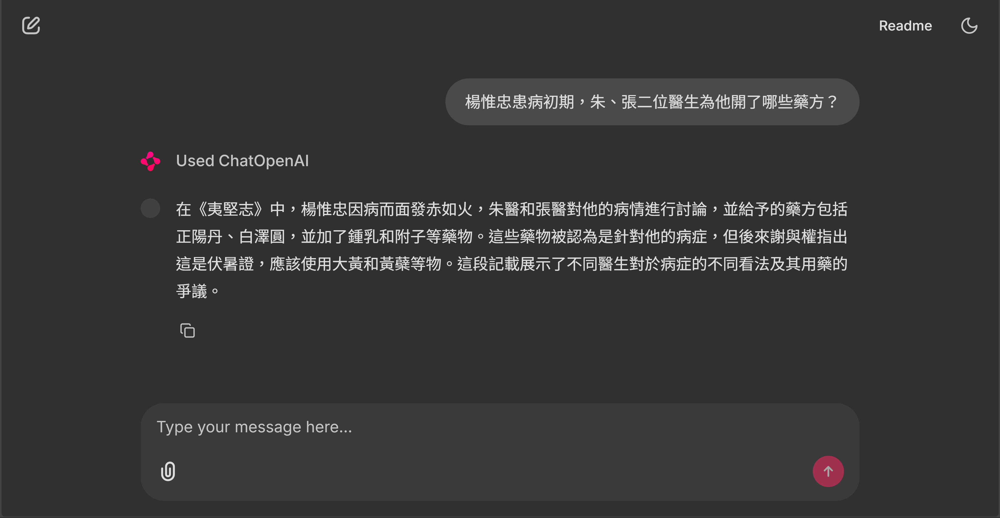

# Yijian Zhi Chatbot
A RAG chatbot based on OpenAI API that can answer questions about "Yijian Zhi" (夷堅志).



## Installation

Follow these steps to install and set up:

1.  **Clone the Repository:**
    ```bash
    git clone https://github.com/youkwan/yijian-zhi-chatbot.git
    cd ./yijian-zhi-chatbot/
    ```

2.  **Install uv(if not already installed):**
    This project uses [uv](https://github.com/astral-sh/uv) to manage the virtual environment and dependencies. If you don't have uv installed, follow the [official installation guide](https://docs.astral.sh/uv/getting-started/installation/).

3.  **Configure Environment Variables:**
    Copy the example environment file:
    ```bash
    cp .env.example .env
    ```
    Then, open the `.env` file in the `backend` directory with a text editor and fill in the required configuration values (e.g., OPENAI API key, LangSmith API key, etc.).


3.  **Start the Application:**
    In the `backend` directory, run:
    ```bash
    uv run chainlit run app.py --port 8000
    ```
    The backend will start and run at http://localhost:8000